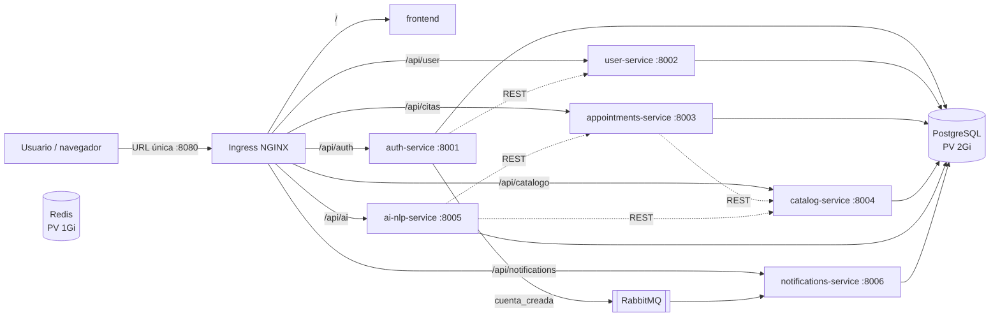

# H-16 – Orquestación en Kubernetes

EPS Digital corre en un clúster Kubernetes (Minikube) con una única URL de entrada.

## Arquitectura



- **Un solo Postgres** (StatefulSet) con 6 bases lógicas: `eps_auth`, `eps_user`, `eps_citas`,
  `eps_catalogo`, `eps_ainlp`, `eps_notifications`. Usa la imagen `pgvector/pgvector:pg15`
  (PostgreSQL 15 + extensión `vector`) porque la migración de ai-nlp en `develop` crea una columna `vector(768)`.
- **Redis** queda aprovisionado como caché para uso futuro: ningún servicio lo consume todavía.
- Las imágenes se construyen dentro de Minikube (`imagePullPolicy: Never`), sin registro externo.

## ¿Por qué Minikube?

- **Gratis**: no hay costo de nube; corre en un Codespace del plan gratuito (el PC no necesita virtualización).
- **Misma API de Kubernetes que EKS/GKE/AKS**: los manifiestos (Deployment, Service, Ingress, PV/PVC, probes)
  se llevan a un clúster gestionado sin cambios de fondo.
- Incluye el addon `ingress` (NGINX), suficiente para la URL única.

## Cómo desplegar

Desde un Codespace creado sobre esta rama (o cualquier máquina con Docker + Minikube + kubectl):

```bash
bash k8s/deploy.sh          # idempotente: minikube, ingress, imágenes, secreto, manifiestos, port-forward 8080
bash k8s/evidencias.sh      # genera k8s/evidencias-h16.txt
```

Secretos: `deploy.sh` crea `eps-secrets` desde un `.env` (si existe) o genera `JWT_SECRET_KEY` y
`POSTGRES_PASSWORD` aleatorios con placeholders para las API keys. Plantilla en `secret.example.yaml`.
Para activar el chatbot, poner `GROQ_API_KEY` (y/o las de Gemini/Cerebras/Mistral) reales en `.env` y volver a ejecutar `deploy.sh`.

Desde el PC de Windows, un solo comando: `powershell -ExecutionPolicy Bypass -File .\levantar-demo.ps1`.

Rutas del Ingress: `/` → frontend; `/api/<auth|user|citas|catalogo|ai|notifications>/...` → servicio
(se elimina el prefijo `/api/<servicio>`; p. ej. `/api/auth/health` → `auth-service /health`).

## Criterios H-16

| # | Criterio | Archivos | Evidencia (`k8s/evidencias-h16.txt`) |
|---|---|---|---|
| 1 | Arquitectura del clúster y plataforma (Minikube) | `k8s/README.md`, `.devcontainer/devcontainer.json`, `k8s/deploy.sh` | Sección 1: `kubectl get nodes`, versión de Minikube |
| 2 | Deployment y Service de los 6 microservicios | `k8s/services/*.yaml` (6), `k8s/frontend.yaml`, `k8s/kustomization.yaml` | Sección 2: `kubectl get all` |
| 3 | Ingress con URL única | `k8s/ingress.yaml`, `frontend/src/app/lib/apiClient.ts` (modo gateway), `frontend/Dockerfile.k8s` | Sección 4: `kubectl get ingress` y `curl` a `/` y a `/api/*/health` |
| 4 | Liveness y readiness probes | `/health` y `/ready` en `services/*/app/main.py`; `probes` en cada manifiesto | Sección 3: `describe` con `Liveness`/`Readiness` |
| 5 | PV y PVC para PostgreSQL y Redis | `k8s/postgres/postgres.yaml`, `k8s/redis/redis.yaml` | Secciones 2 y 5: `get pv,pvc` y prueba de persistencia tras borrar los pods |
